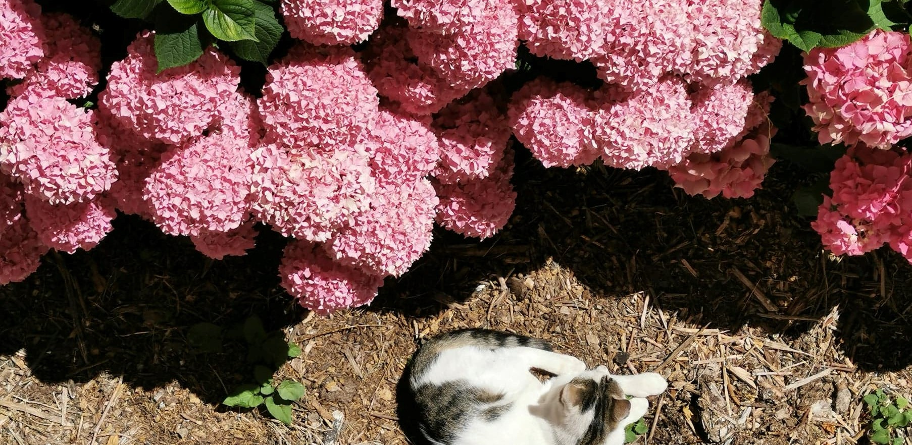

<header class="post-header">
  <h1 class="post-title">Hello! I'm Raphaëlle.</h1>
</header>
  
  <h2>
    I'm Raph. I'm motivated by affecting positive social and environmental change in the world. </h2>
  
  
 This is where I <a href = "https://raphaelletseng.github.io/blog/">write</a> about things that I am learning in my field of computer science, my interests in literature and the <a href="https://raphaelletseng.github.io/art/">arts</a>, and my pursuits working with NGOs and environmentalists. 

  

<link rel="stylesheet" href="../assets/css/index.css">
